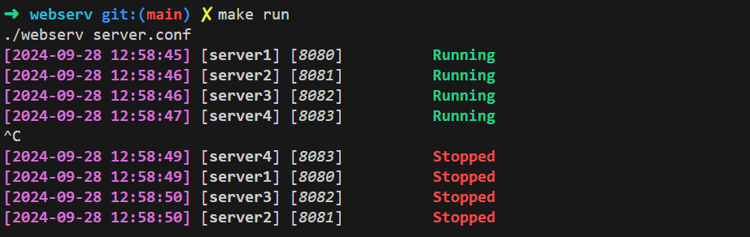

<h1 align="center">
	📖 42-Webserv
</h1>

<p align="center">
	
	
	
	
</p>

<h3 align="center">
	<a href="#-running-the-server">Running</a>
	<span> · </span>
	<a href="#-running-the-server">Configuration</a>
	<span> · </span>
	<a href="#-key-features">Key features</a>
</h3>


# 💡 About the project
>This is when you finally understand why a URL starts
with HTTP.

This project is about writing a HTTP/1.1 server.


## 🚀 Running the server 

```bash
make run
```
It will automatically compile the project and run it.
```bash
./webserv [configuration file]
```
Will launch the previously compiled project with `make` and run it. (configuration file must be a valid `.conf` file see section below)



## 💻 configurating the server

</br>It will allow you to setup the following parameters :
- `name` -- define the server name
- `listen`:`port` -- to configure on which port the server will be listening (only one `listen` per `server` block)
- `methods` -- to set the authorized HTTP request (`GET` | `POST` | `DELETE`)
- `location` -- to set parameters for a specific route
- `index` -- to serve a default file if none match the requested URI
- `root` -- to route the requested URI to another directory
- `upload` -- to set a specific directory for upload requests
- `listing` -- to list all files present in the targeted directory (`ON` | `OFF`)
- `error` -- to define the allowed methods for HTTP requests
- `cgi` -- to configure a cgi to execute for a specific file extenstion (`.php` | `.py` | `.pl`)

------------
## 📜 Key Features

- **Configuration Flexibility**  
  -- Accepts a custom configuration file or defaults to a predefined path

- **Non-Blocking Architecture**  
  -- Uses a single `select()` (or equivalent) per server for all I/O operations, including listening and client communication

- **Efficient Resource Management**  
  -- Handles all read/write operations via `select()`, optimizing resource usage and **preventing blocking**

- **HTTP Methods**  
  -- Supports `GET`, `POST`, and `DELETE`

- **File Uploads**  
  -- Allows clients to upload files directly to the server

- **Static File Serving**  
  -- Serves static websites

- **Accurate HTTP Responses**  
  -- Delivers precise status codes along with a specified error page or a default one

- **CGI Integration**  
  -- Supports CGI execution (e.g., `PHP`, `Python`, `Perl`, ...)

- **Multi-Port Listening**  
  -- Listens on multiple ports as defined in the configuration file

- **Browser Compatibility**  
  -- Compliant with HTTP 1.1 standards.

- **Handle Cookies**  
  -- A small cookie clicker has been made to show the implementation of the cookies

- **Keep-alive connection**  
  -- Connection is kept alive if possible

- **Time out**  
  -- Timeout for CGI and basic requests

---


---
This group project was done by [MVPee (mvan-pee)](https://github.com/MVPee) and [Dan (dspilleb)](https://github.com/dspilleb)
